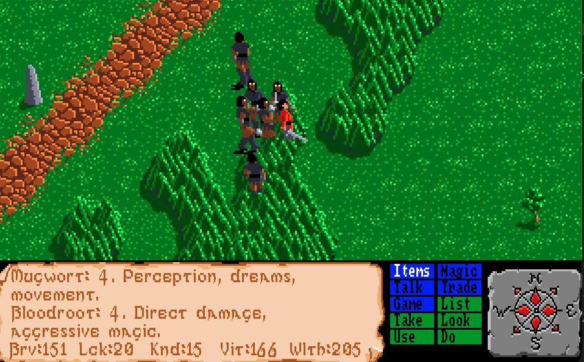
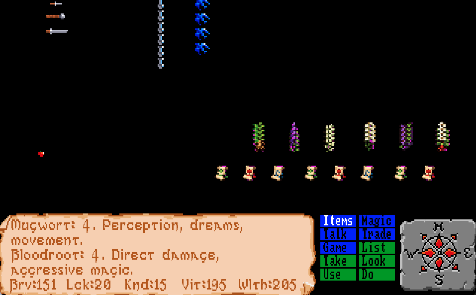
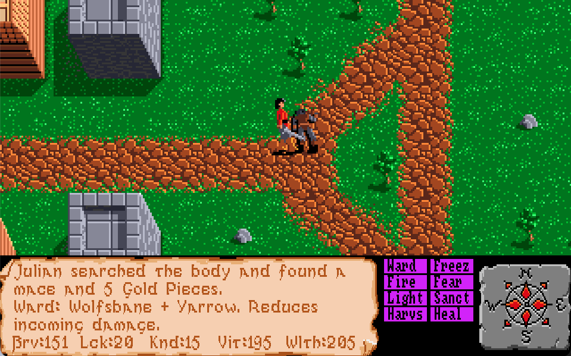
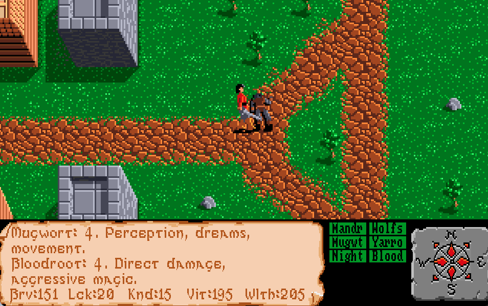

# Faery Tale Adventure

This fork expands the original game with larger encounters, quality-of-life
improvements, persistent door state, local save files, and a collectible spell
system.

## Screenshots

| Expanded encounters | Spell scrolls and ingredients |
| --- | --- |
|  |  |

| Spell menu | Herb inventory |
| --- | --- |
|  |  |

## Controls

| Action | Control |
| --- | --- |
| Move | Arrow keys, `W`, `A`, `S`, `D`, or hold the left mouse button over the playfield |
| Attack | `Space` or hold the right mouse button |
| Take nearby items | `E` or `Items > Take` |
| Talk | `T` or the `Talk` menu |
| Eat an apple | `F` or `Items > Do > Eat` |
| Use a potion | `P` |
| Toggle fullscreen | `F11` or `Alt+Enter` |

The game window is resizable. The original aspect ratio is preserved when the
window changes size or switches to fullscreen.

## Gameplay Changes

### Enemies

- Increased actor capacity from 20 to 48.
- Increased simultaneous enemies from 3 to 30.
- Expanded combat cooldown and rendering arrays so additional enemies attack
  and render correctly.
- Increased random encounter likelihood with a 20x multiplier, capped at the
  maximum roll threshold.
- Wraiths are the main source of magical supplies. Ingredients are frequent and
  spell scrolls are rare.

### Player Setup

Julian now starts with:

- 200 vitality
- A stronger weapon configuration
- 150 bravery
- 200 gold
- 6 glass vials
- 4 Bird Totems
- Initial weapon inventory entries

### Apples and Camping

- Added a stash of 10 apples at Julian's spawn location.
- Added 1,000 apples across the outdoor map: 125 per outdoor region.
- Apple placement prefers grass next to trees.
- Eating an apple reduces hunger by 30.
- Camping is available from `Items > Do > Camp`.
- Camping is allowed outdoors when the player is tired and not fighting.
- Camping consumes 2 apples.
- Camp sleep does not apply the bed-specific wake-up position adjustment.

### Prayer Skeletons and Dark Priest

- Added 6 non-hostile skeleton NPCs at the nearby stone circle.
- They render using the skeleton enemy sprites.
- Talking to them displays `"Ohm Ohm!"`.
- A dark priest stands at the center and chants changing incantations.

### Trade

`Trade` combines the `Buy`, `Sell`, and `Give` actions. Tavern bartenders trade
ordinary goods. A mysterious wizard at Tambry's entrance buys and sells magical
ingredients.

| Item | Sale price |
| --- | ---: |
| Apple | 100 gold |
| Grey key | 50 gold |

Wizard herb prices:

| Ingredient | Buy | Sell |
| --- | ---: | ---: |
| Mandrake | 30 gold | 15 gold |
| Wolfsbane | 40 gold | 20 gold |
| Mugwort | 25 gold | 12 gold |
| Yarrow | 20 gold | 10 gold |
| Nightshade | 45 gold | 22 gold |
| Bloodroot | 50 gold | 25 gold |

### Doors and Saves

- Doors unlocked with keys remain unlocked when reopened.
- Up to 128 unlocked doors are tracked.
- Unlocked-door state is saved and loaded.
- Older saves remain compatible because the new door data is appended
  optionally.
- `Game > Save` and `Game > Load` provide slots `A` through `H`.
- Save files are written locally using the slot name, such as `A` or `B`.

### Bird Totem

- Bird Totems open a dedicated overhead region map.
- The map displays terrain, roads, stone circles, living actors in red, and the
  player as a blinking white and yellow marker.
- Any key, click, or movement closes the map.

## Magic, Ingredients, and Spells

Magical ingredients and scrolls appear as distinct sprites in the world and
inventory. A spell becomes available after its matching scroll has been
collected. Casting consumes ingredients but does not consume the scroll.

| Magic menu action | Purpose |
| --- | --- |
| `Magic > Spell` | Cast an available spell |
| `Magic > Study` | Review collected scroll recipes and effects |
| `Magic > Herbs` | Inspect ingredient quantities and properties |

### Magical Ingredients

| Ingredient | Properties |
| --- | --- |
| Mandrake | Healing, growth, vitality |
| Wolfsbane | Protection, suppression |
| Mugwort | Perception, dreams, movement |
| Yarrow | Light, safety, navigation |
| Nightshade | Poison, fear, curses |
| Bloodroot | Direct damage, aggressive magic |

### Available Spells

| Spell | Required ingredients | Effect |
| --- | --- | --- |
| Ward | 1 Wolfsbane + 1 Yarrow | Reduces incoming damage for a limited time |
| Freeze | 2 Wolfsbane + 1 Mugwort | Briefly stops enemies like the Gold Ring |
| Fire | 1 Bloodroot + 1 Nightshade | Damages nearby enemies |
| Fear | 1 Nightshade + 1 Bloodroot | Makes weaker nearby enemies flee |
| Light | 1 Yarrow | Illuminates dark areas like the Green Jewel |
| Sanctuary | 2 Wolfsbane + 2 Yarrow | Prevents new enemy encounters temporarily |
| Harvest | 1 Mandrake + 1 Mugwort | Collects nearby items, including loot carried by living and dead enemies |
| Heal | 1 Wolfsbane + 1 Mandrake | Restores 15 health |
